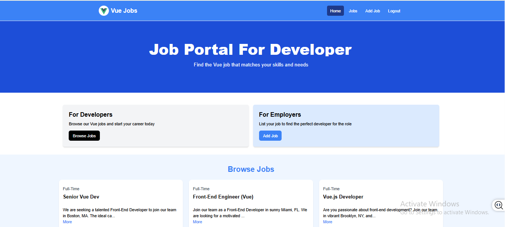

# Vue Jobs Portal 

This is the jobs listing project :https://vue-devjob-portal.netlify.app



## Usage

This project uses JSON-Server for a mock backend.

### Install Dependencies

```bash
npm install
```

### Run JSON Server

The server will run on http://localhost:8000

```bash
npm run server
```

### Run Vite Frontend

Vue will run on http://localhost:3000

```bash
npm run dev
```

### Build for Production

```bash
npm run build
```

### Preview Production Build

```bash
npm run preview

Vue Job Portal
Welcome to the Vue Job Portal, a job listing platform designed for Vue.js developers! 🚀 This project aims to provide an easy-to-use interface for both job seekers and employers in the Vue.js community.

🚀 Live Demo:
You can check out the live demo of the Vue Job Portal here:
Vue Job Portal - Live Demo

📂 GitHub Repository:
Vue Job Portal - GitHub

✨ Features:
Browse Job Listings: View job listings tailored for Vue.js developers.

Job Postings: Employers can easily add and manage job postings.

Fully Responsive Design: The portal is designed to work seamlessly across devices.

Typing Animation: Engaging typing effect on the homepage.

🛠️ Technologies Used:
Frontend:

Vue.js - For building the user interface.

Tailwind CSS - For fast and efficient styling.

Backend (Future Implementation): You can extend this with a backend API for full functionality (currently a static setup).

Deployment:

Netlify for hosting.

📋 Project Setup:
Clone the repository:

bash
Copy
git clone https://github.com/sandeeppaldotnet/vue-job-portal.git
Install dependencies:

Navigate to the project folder and install dependencies:

bash
Copy
cd vue-job-portal
npm install
Run the development server:

After installing dependencies, you can start the local server:

bash
Copy
npm run serve
The app should now be running at http://localhost:8080.

🌱 Future Enhancements:
Authentication: Add login/signup functionality.

Backend Integration: Connect with a backend API for dynamic job listings and authentication.

Admin Dashboard: For employers to manage job postings more effectively.

📬 Feedback & Contributions:
Feel free to contribute by submitting issues or creating pull requests! If you have any feedback or suggestions, I’d love to hear from you!
```
